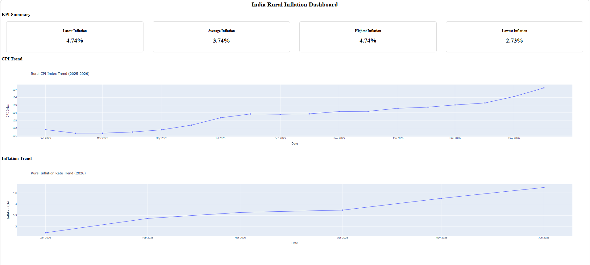

# India Rural Inflation Dashboard

An interactive data analytics project analysing India's rural Consumer Price Index (CPI) and inflation trends using Python.

## Project Overview

Inflation is one of the most important indicators of an economy. This project analyses rural CPI data to understand price movements and inflation trends over time.

## Objectives

- Clean and analyse CPI dataset
- Calculate inflation rates
- Visualize CPI movement
- Build an interactive dashboard

## Tools Used

- Python
- Pandas
- NumPy
- Plotly
- Jupyter Notebook

## Dataset

Source:
Consumer Price Index (CPI) data for India

Variables analysed:
- Year
- Month
- Rural CPI Index
- Inflation Rate

## 📈 Key Insights

- Latest Rural Inflation Rate: **4.74%**
- Average Inflation Rate: **3.74%**
- Highest Inflation Rate: **4.74%**
- Lowest Inflation Rate: **2.73%**

The dashboard helps visualize how rural inflation changed during the analyzed period.

## Dashboard Preview

## Project Structure
data
notebooks
outputs
images

## Conclusion

This project demonstrates the application of Python-based data analysis techniques to understand economic indicators and present insights through interactive visualization.

